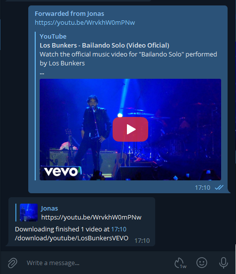

# Telethon Downloader

[](https://github.com/jsavargas/telethon_downloader)
[](https://hub.docker.com/r/jsavargas/telethon_downloader)
[](https://hub.docker.com/r/jsavargas/telethon_downloader/)
[](https://hub.docker.com/r/jsavargas/telethon_downloader/)
[](https://hub.docker.com/r/jsavargas/telethon_downloader/)


## Find us at:

[](https://github.com/jsavargas/telethon_downloader)
[](https://hub.docker.com/r/jsavargas/telethon_downloader)
[](https://discord.gg/FdJMau8sf6)


<p align="center">
    
</p>


# [jsavargas/telethon_downloader](https://github.com/jsavargas/telethon_downloader)


Telegram Bot on a [Telethon client](https://github.com/LonamiWebs/Telethon) that auto downloads incoming media files.




# Running Telethon Downloader

## Environment:

 Pull or build the docker image and launch it with the following environment variables:

 **TG_AUTHORIZED_USER_ID** : <telegram ´chat_id´ authorized> 
 
 **TG_API_ID** : <telegram API key generated at ´Generating Telegram API keys´>

 **TG_API_HASH** : <telegram API hash generated at ´Generating Telegram API keys´>

 **TG_BOT_TOKEN** : <telegram BOT token generated at ´Creating a Telegram Bot´>
 
 **TZ** : America/Santiago


 **TG_MAX_PARALLEL** [OPTIONAL]: <maximum number of parallel downloads allowed (default: 4)>
 
 **TG_DL_TIMEOUT** [OPTIONAL]: <maximum time (in seconds) to wait for a download to complete. after this time the download is cancelled and an error is triggered (default: 3600)>

 >NOTE: DOWNLOADED FILES ARE SAVED AT A TMP DIRECTORY UNTIL THE DOWNLOAD IS COMPLETED TO PROTECT FROM MOVING UNFINISHED FILES

 **YOUTUBE_LINKS_SUPPORTED** [OPTIONAL]: <YouTube links supported for downloading videos (default: youtube.com,youtu.be)>
>NOTE: NOTE: THIS VARIABLE MUST BE UPDATED IF MORE URL IS REQUIRED TO BE ADDED TO THE YOUTUBE DOWNLOAD SUPPORT

## Volumes:

 **/download** : folder where files are downloaded
 
 **/watch** : folder where torrent files are downloaded where transmission will upload them


# Generating Telegram API keys

Before working with Telegram's API, you need to get your own API ID and hash:

1. Go to https://my.telegram.org/ and login with your
   phone number.

2. Click under API Development tools.

3. A *Create new application* window will appear. Fill in your application
   details. There is no need to enter any *URL*, and only the first two
   fields (*App title* and *Short name*) can currently be changed later.

4. Click on *Create application* at the end. Remember that your
   **API hash is secret** and Telegram won't let you revoke it.
   Don't post it anywhere!

# Creating a Telegram Bot

1. Open a conversation with [@BotFather](https://telegram.me/botfather) in Telegram

2. Use the /newbot command to create a new bot. The BotFather will ask you for a name and username, then generate an authorization token for your new bot.

   The name of your bot is displayed in contact details and elsewhere.

   The Username is a short name, to be used in mentions and telegram.me links. Usernames are 5-32 characters long and are case insensitive, but may only include Latin characters, numbers, and underscores. Your bot's username must end in ‘bot’, e.g. ‘tetris_bot’ or ‘TetrisBot’.

   The token is a string along the lines of 110201543:AAHdqTcvCH1vGWJxfSeofSAs0K5PALDsaw that is required to authorize the bot and send requests to the Bot API. Keep your token secure and store it safely, it can be used by anyone to control your bot.

# docker-compose

```dockerfile
version: '3'
services:
  telethon_downloader:
    image: jsavargas/telethon_downloader
    container_name: telethon_downloader
    restart: unless-stopped
    network_mode: host
    environment:
      - 'PUID=1000'
      - 'PGID=1000'
      - 'TG_AUTHORIZED_USER_ID=63460,645261' #<telegram chat_id authorized>
      - 'TG_API_ID=<telegram API key generated at ´Generating Telegram API keys´>'
      - 'TG_API_HASH=<telegram API hash generated at ´Generating Telegram API keys´>' 
      - 'TG_BOT_TOKEN=<telegram BOT token generated at ´Creating a Telegram Bot´>'
      - 'TZ=America/Santiago'
    volumes:
      - /path/to/config:/config
      - /path/to/download/torrent/watch:/watch
      - /path/to/download:/download
```


## **Changelog:**

**v3.1.12 (2023.08.17):**
- upgrade yt-dlp to version 2023.07.06

**v3.1.11 (2023.03.31):**
- upgrade python to version 3.11

**v3.1.10 (2023.02.28):**
- upgrade python to version 3.11

**v3.1.9 (2023.02.01):**
- upgrade telethon to version 1.26.1

**v3.1.8 (2022.10.10):**
- change docker building

**v3.1.7 (2022.09.30):**
- change youtube-dlp to yt-dlp
- Fixed bugs
- Added more bugs to fix later (?) xD

**v3.0.1 (2021.10.28):**
- Added config.ini file in /config
- Added regex support

